```{r setup, include=FALSE}
knitr::opts_chunk$set(echo = TRUE)
setwd("~/github/2023_06_rnaseq_tutorial/")
# create an alignments folder if needed
if (!file.exists("aligments")) {dir.create("aligments")}

# Install Rsubread and Rsamtools and call the libraries: You only need to install it once! So I commented out the install--uncomment it for your first run!
#if (!requireNamespace("BiocManager", quietly = TRUE))
#    install.packages("BiocManager")
#BiocManager::install("Rsubread")
#BiocManager::install("Rsamtools")
library(Rsubread)
library(Rsamtools)

```

## Objective

* Disclaimer: non-comprehensive introduction to RNA-sequencing 
* Introduce preprocessing steps
* Visualization 
* Analytical methods 
* Common software tools

## Steps to an RNA-seq Analysis (Literacy)
1. Preprocessing and QC:
    + Fasta and Fastq files
    + FastQC: good vs. bad examples
    + Visualization
2. Alignment
    + Obtaining genome sequence and annotation
    + Software: Bowtie, TopHat, STAR, Subread/Rsubread
3. Expression Quantification
    + Count reads hitting genes, etc
    + Approaches/software: HT-Seq, STAR, Cufflinks, RPKM FPKM or CPM, RSEM, edgeR, findOverlaps (GenomicRanges). featureCounts (Rsubread)
4. More visualization
    + Heatmaps, boxplots, PCA, t-SNE, UMAP
5. Differential Expression
    + Batch correction
    + Overdispersion
    + General Workflow
    + Available tools: edgeR, DESeq, Limma/voom
    + Even more visualization!!

## Illumina Sequencing Workflow

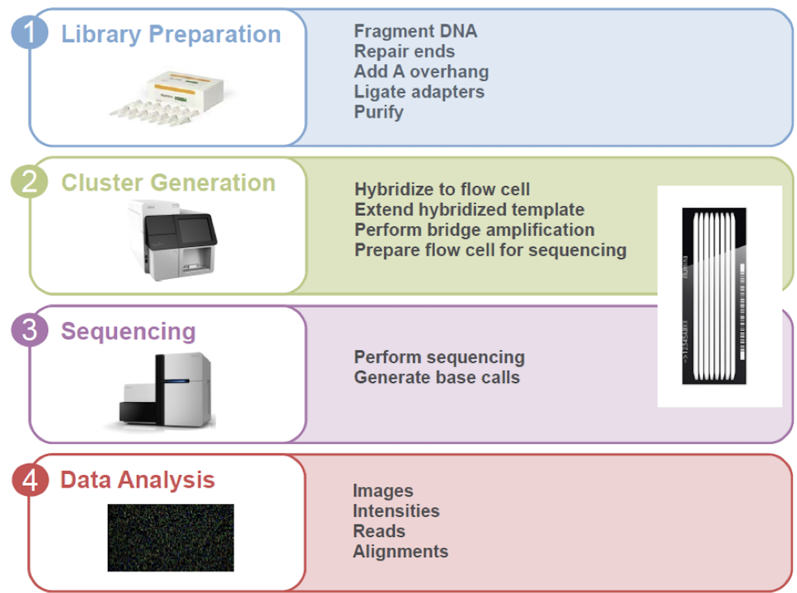

## Sequencing Data Formats {.tabset}

Genome sequcencing data is often stored in one of two formats, FASTA and FASTQ text files. For example a FASTA files looks like the following: 

### FASTA Files
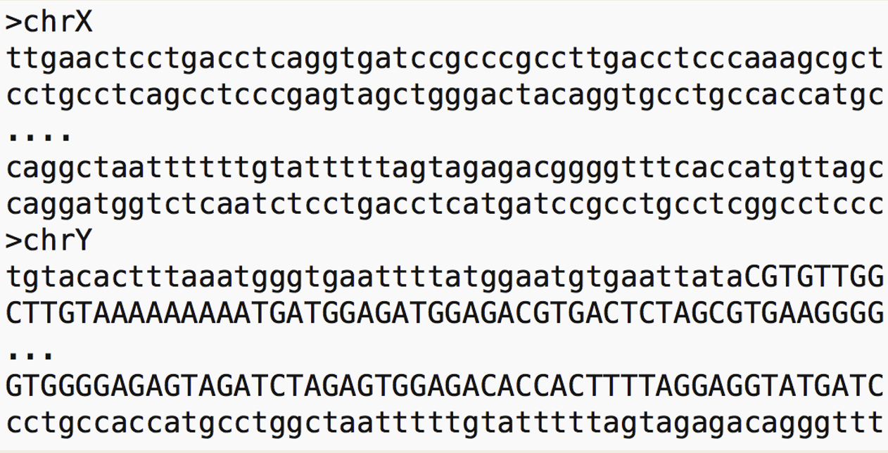

### FASTQ Files
We can also store confidence or quality scores using a FASTQ format: 
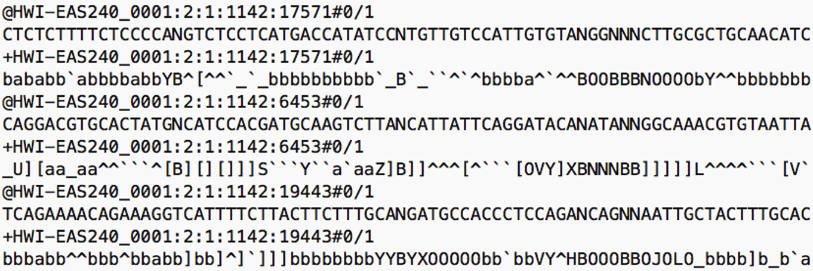

### FASTQ Encoding
In order to translate FASTQ quality scores: 

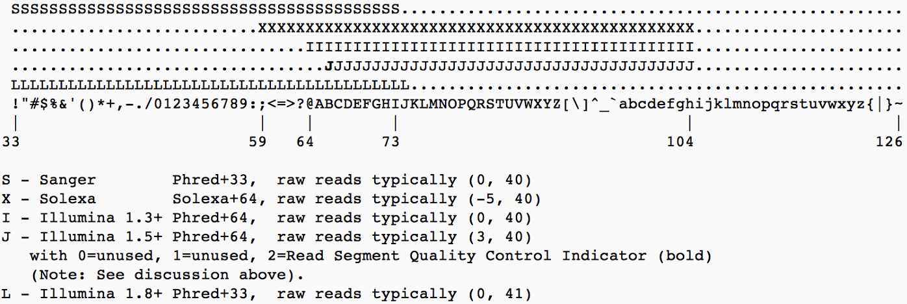

### FASTQ Probability
And now converting to confidence probabilities: 

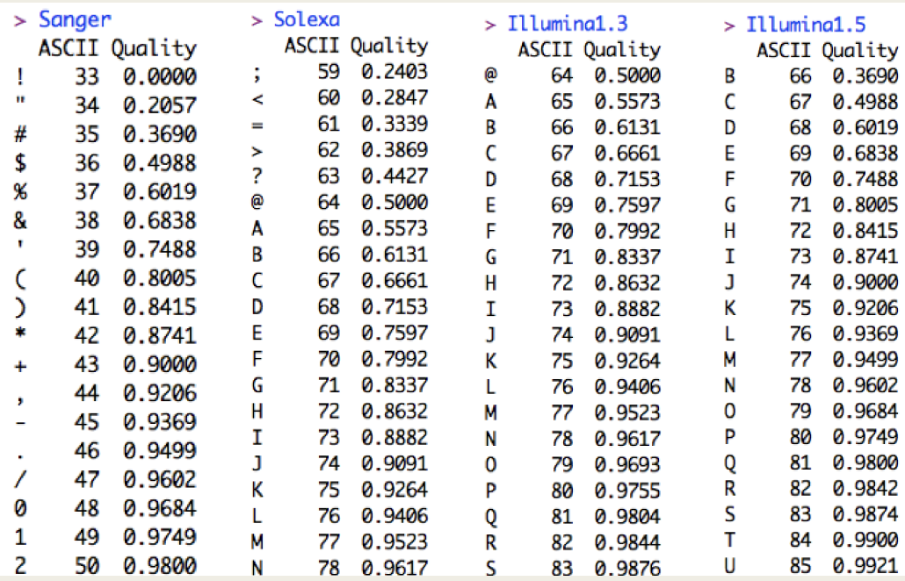

## Preprocessing and QC using FASTQC {.tabset}
FastQC (http://www.bioinformatics.babraham.ac.uk/projects/fastqc/) provides a simple way to do QC checks on raw sequence data:  

* Import of data from BAM, SAM or FastQ files
* Quick overview and summary graphs and tables to quickly assess your data
* Export of results to an HTML based permanent report
* Offline operation to allow automated generation of reports without running the interactive application

### FastQC Scores
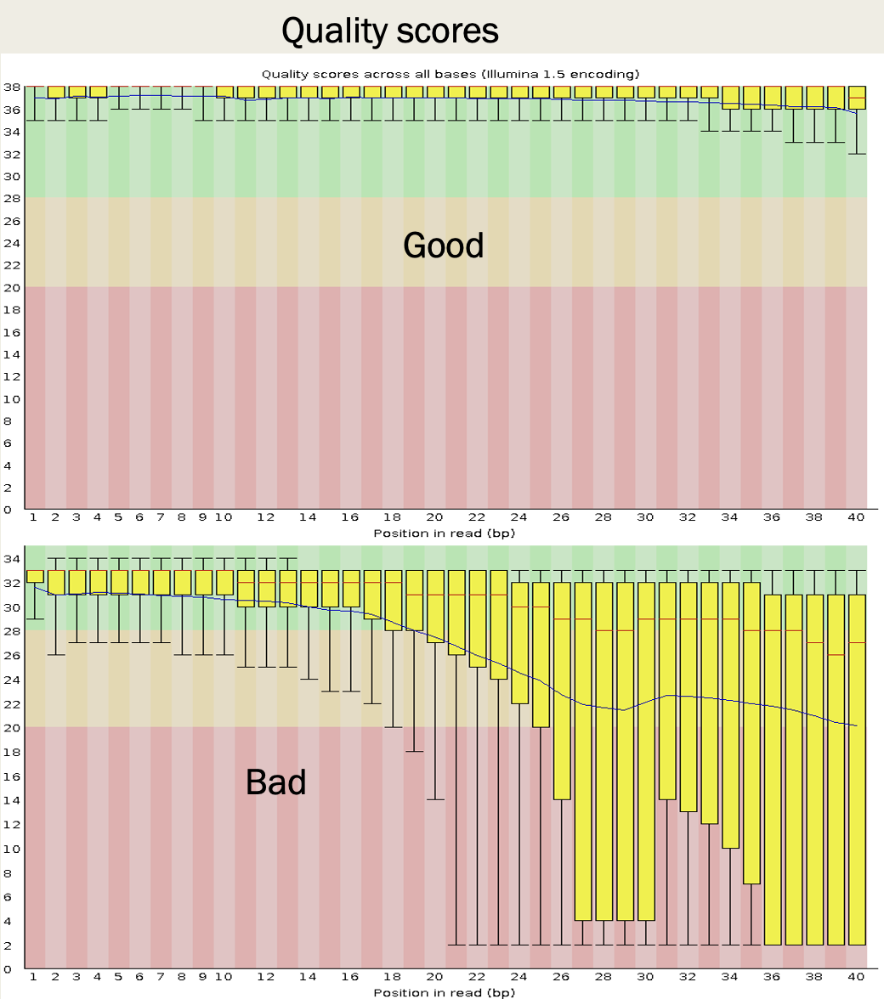

### FastQC Score Distribution
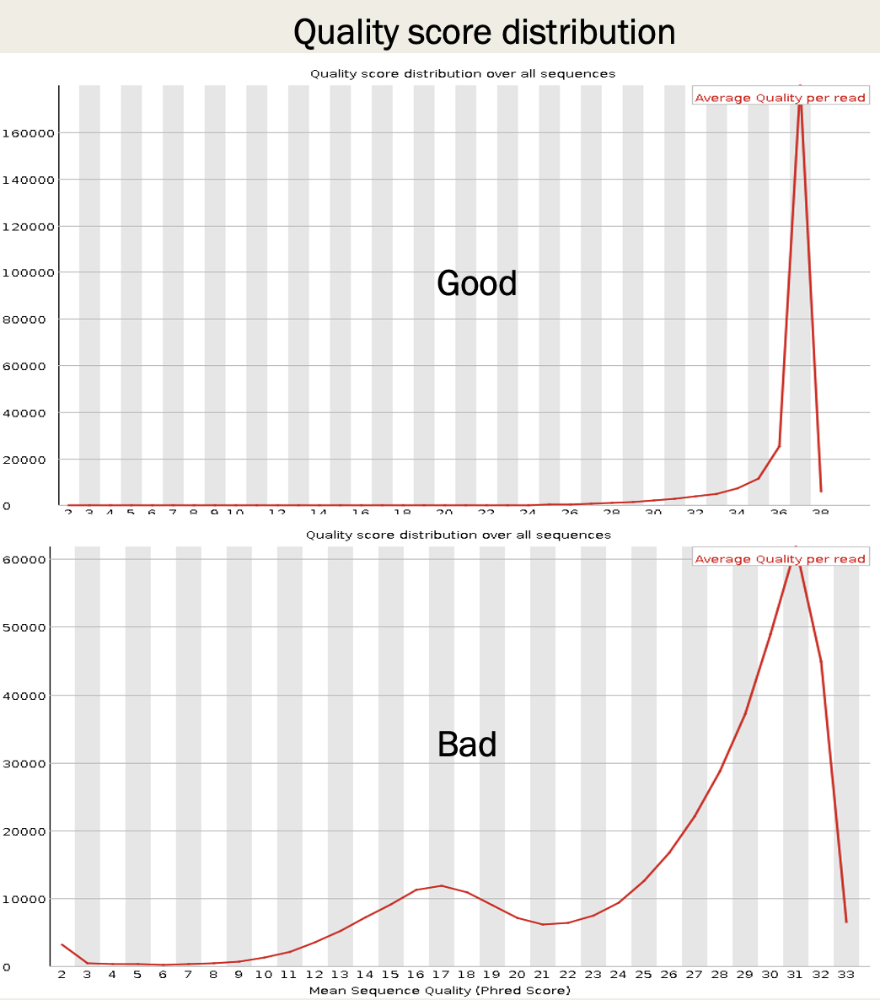

### FastQC Base Distribution
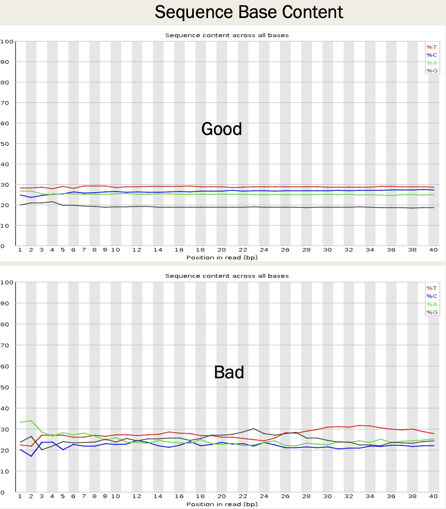


### FastQC N Distribution
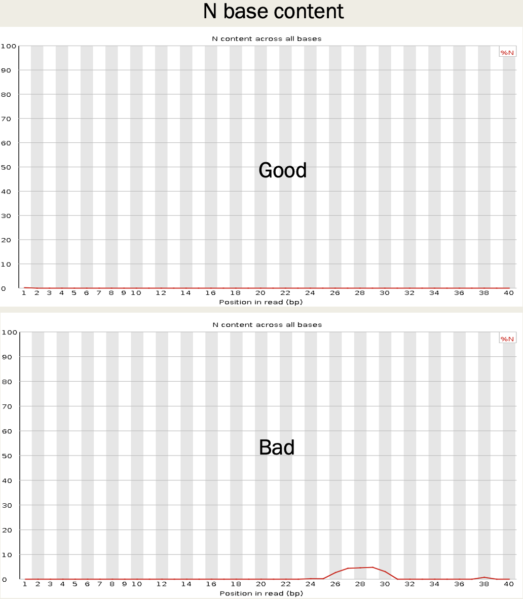

## Alignment to the Reference Genome

Find the genomic Location of origin for the sequencing read. Software: Bowtie2, TopHat, STAR, Subread/Rsubread, many others!

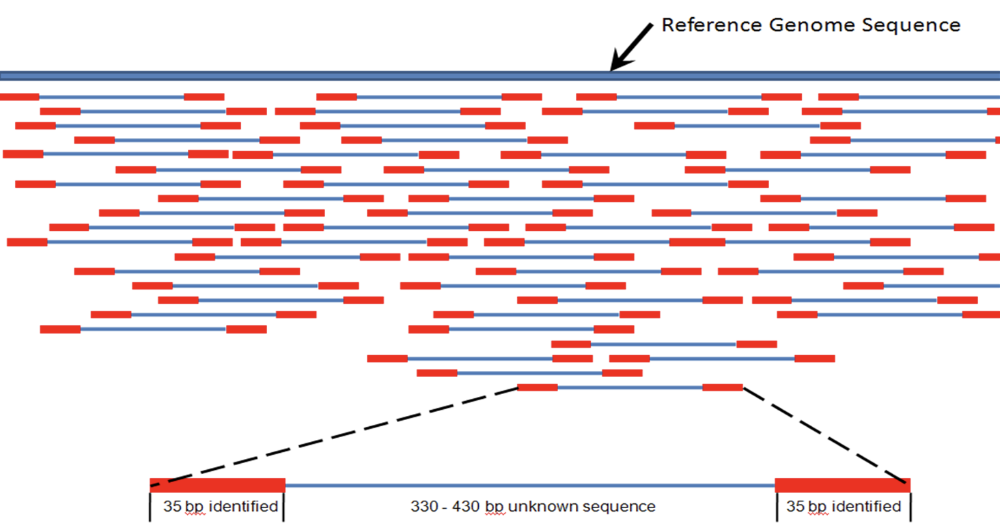

<a href=figs/hash_align.pdf>Here is quick tutorial on sequnce aligment.</a>

### Using Rsubread to do Alignment
The following userguide will be helpful for you: 

http://bioinf.wehi.edu.au/subread-package/SubreadUsersGuide.pdf


## Indexing your genome

> Abraham Lincoln: "Give me six hours to chop down a tree and I will spend the first four sharpening the axe." (4 minutes indexing the genome, 2 minutes aligning the reads)

Note that you will rarely do this for human alignment. You will usually download an existing index given to you by others who have already done this work. You will do this often if you are aligning microbial reads, e.g. MTB or some other organism for which others have not already made your index for you.

```{r}
buildindex(basename="genome/ucsc.hg19.chr1_120-150M",reference="genome/ucsc.hg19.chr1_120-150M.fasta.gz")
```
#### Took me ~0.2 minutes

## Aligning your reads:  
Note that this outputs results in a .bam file and not a .sam file

```{r, eval=F, include=F}
align(index="genome/ucsc.hg19.chr1_120-150M",readfile1="reads/R01_10_short6M.fq.gz",output_file="alignments/R01_10_short.bam", nthreads=4) 
```

```{r eval=F, include=F}
align(index="genome/ucsc.hg19.chr1_120-150M",readfile1="reads/R01_10_short500K.fq.gz",output_file="alignments/R01_10_short.bam", nthreads=4) 
```

```{r}
align(index="genome/ucsc.hg19.chr1_120-150M",readfile1="reads/R01_10_short500K.fq.gz",output_file="alignments/R01_10_short.bam", nthreads=4) 
```

#### My laptop is an Apple M2, which has 8 cores (used 4 cores), 24GB RAM 
#### Took 15.7 minutes to align ~60M reads to the 30M bases
#### Took 0.7 minutes to align ~6.5M reads to the 30M bases
#### Took 0.3 minutes to align ~500K reads to the 30M bases

## Aligned Sequencing Data Formats (SAM and BAM)
Note that Rsubread outputs a .bam file (bam = binary alignment map) and not a .sam file (sam = sequence alignment map). Here is some information about a .sam file: 

https://en.wikipedia.org/wiki/SAM_(file_format)

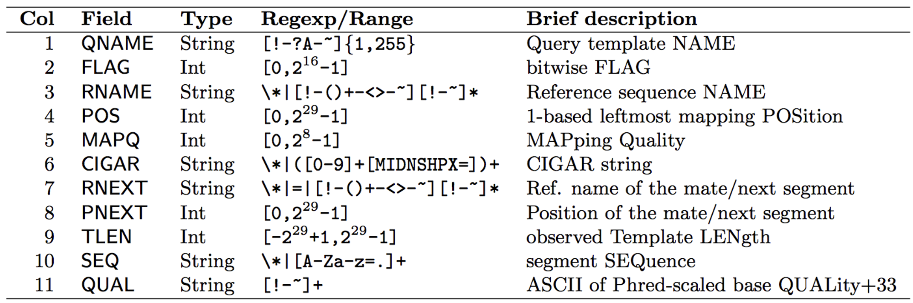

https://samtools.github.io/hts-specs/SAMv1.pdf

To convert .sam to .bam or vice versa, a package called Rsamtools. Using Rsamtools, you can convert bam to sam as follows:

```{r}
asSam("alignments/R01_10_short.bam", overwrite=T) 

# To convert to bam:
#asBam("alignments/R01_10_short.bam") 

```

Makes a system call to the Mac terminal to generate a .sam file


## Feature counts
Now we can count reads hitting genes. Approaches/software: 

* HT-Seq
* STAR
* Cufflinks
* RPKM FPKM or CPM
* RSEM
* edgeR
* findOverlaps (GenomicRanges)
* featureCounts (Rsubread)

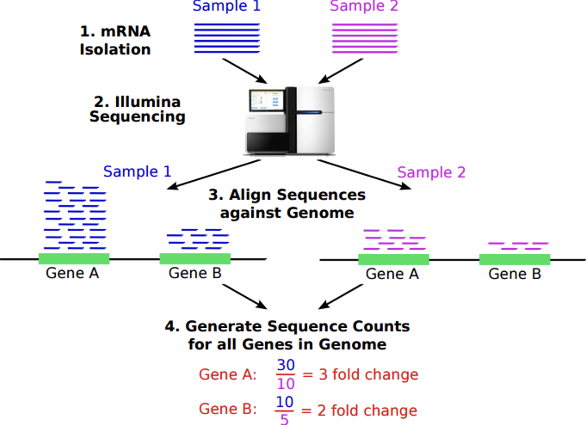

```{r}
fCountsList = featureCounts("alignments/R01_10_short.bam", annot.ext="genome/genes.chr1_120-150M.gtf", isGTFAnnotationFile=TRUE)

featureCounts = cbind(fCountsList$annotation[,1], fCountsList$counts)

write.table(featureCounts, "alignments/R01_10_short.features.txt", sep="\t", col.names=FALSE, row.names=FALSE, quote=FALSE)

```


### SCTK
#### Use the Single Cell Toolkit to analyze your RNA-seq data!
```{r, eval=F}
#install.packages("devtools")
#devtools::install_github("wevanjohnson/singleCellTK")
library(singleCellTK)
singleCellTK()

### open features_combined.txt
### and meta_data.txt
```
